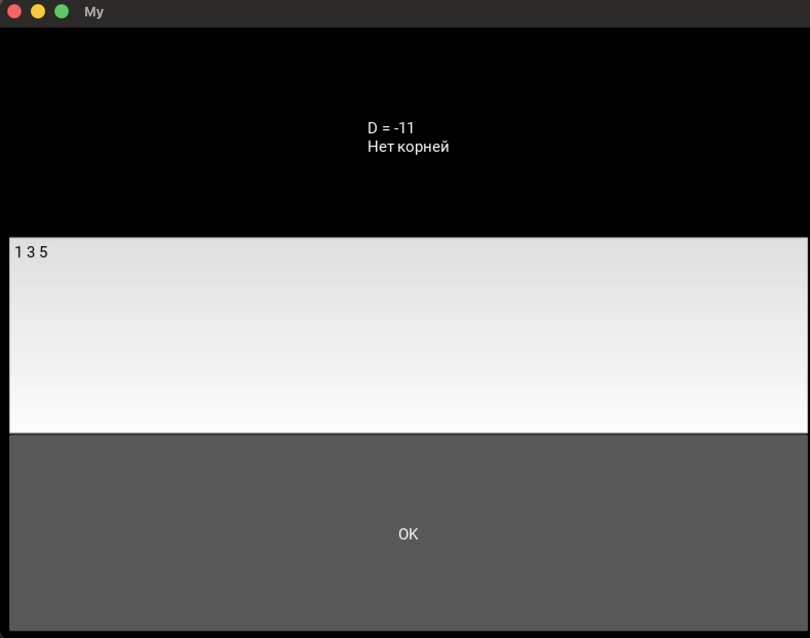

# Это приложение считает корни квадратного уравнения по коэффициентам

## **Сборка с помощью Buildozer**

### Установка:

# Ubuntu/Debian
sudo apt update

sudo apt install -y git zip unzip openjdk-17-jdk python3-pip autoconf libtool pkg-config zlib1g-dev libncurses5-dev libncursesw5-dev libtinfo5 cmake libffi-dev libssl-dev

pip3 install --user --upgrade buildozer cython virtualenv

# Добавить в PATH
export PATH=$PATH:~/.local/bin/

### Настройка проекта:
 1. Создать папку проекта
mkdir myapp
cd myapp

2. Создать основной файл приложения
main.py - ваш основной файл Kivy

3. Инициализировать buildozer
buildozer init

4. Редактировать buildozer.spec
Важные параметры:
title = My Application
package.name = myapp
package.domain = org.test
source.dir = .
source.include_exts = py,png,jpg,kv,atlas,ttf
requirements = python3,kivy
orientation = portrait
android.permissions = INTERNET

### Сборка APK:
# Первая сборка (займет много времени)
buildozer -v android debug

# Сборка release версии
buildozer android release
